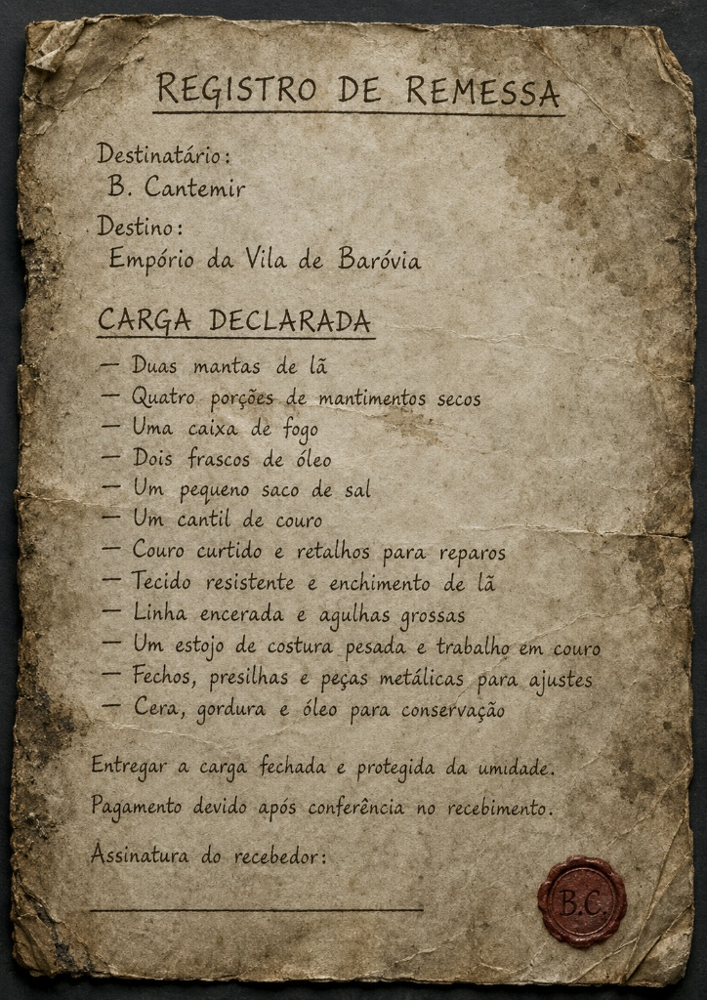

# Sessão 06 — A Estrada sem Sol

> [!info] Sem spoilers
> Este recap contém apenas o que o grupo viveu, viu, discutiu ou descobriu durante a sessão.

Depois de tudo o que aconteceu na [[Casa da Morte]], parecia que a pior parte já tinha ficado para trás.

A casa discordava.

---

## A última corrida

A fuga começou de verdade na **sala dos lobos**, já deformada pela versão demoníaca da casa.

Havia **fumaça**, **lâminas giratórias**, madeira gemendo por todos os lados e a sensação claríssima de que a casa ainda queria mais um corpo antes de deixá-los partir.

O grupo improvisou como pôde:

- **Dhorak** usou móveis e força bruta para atrapalhar os mecanismos;
- **Oryn** tentou travar parte do perigo com magia;
- **Lionel** avançou até a saída e segurou a porta;
- os demais correram pelo corredor tentando não virar picadinho.

A cena ficou ainda pior quando **Oryn** tentou atravessar no fim da corrida, foi atingido e caiu **inconsciente praticamente na saída**.

Foi o tipo de momento que faz todo mundo olhar para o nada por dois segundos e pensar:  
**“não... agora não.”**

Mas o grupo não deixou ninguém para trás.

**Dhorak** segurou a passagem.  
**Lionel voltou**.  
E **Vet** conseguiu estabilizar Oryn quando ele finalmente foi arrastado para fora.

---

## A casa ainda arrancou seu preço

Escapar não significou sair ileso.

Quando o grupo enfim atravessou a porta, a casa fez uma última tentativa de cobrar algo em troca. O ar pareceu ser puxado de volta para dentro — e junto dele foram quase todos os equipamentos.

Armas, mochilas, armaduras e objetos de viagem começaram a voar na direção da entrada, como se a casa estivesse literalmente **engolindo o que restava deles**.

Cada um conseguiu salvar apenas o que segurou com mais força — ou aquilo que se recusou a abandonar.

### O que ficou com o grupo

- **Kael** ficou com a **espada curta prateada**;
- **Yann** salvou sua **besta de mão**;
- **Vet** manteve a **maça**;
- **Oryn** preservou o **livro de feitiços de páginas negras**;
- **Dhorak** manteve o **Manto de Proteção**;
- **Lionel** permaneceu com a **armadura** e com as **duas metades do escudo**.

O resto?  
A casa levou.

> [!warning]
> A fuga acabou, mas o preço foi alto: o grupo sobreviveu — e saiu quase sem equipamento.

---

## A casa desapareceu. O mundo não melhorou.

Quando a névoa se abriu de novo, a [[Casa da Morte]] já não estava mais ali.

No lugar dela, havia uma nova estrada.

Uma estrada úmida, fria, vazia e silenciosa, seguindo por uma floresta desconhecida sob uma claridade estranha.

Não havia sol.

Mas também não havia noite.

Só um dia sem calor, sem cor e sem resposta.

> [!quote]
> A casa ficou para trás.  
> Infelizmente, Baróvia estava logo adiante.

---

## Nível 3: depois da casa, ninguém saiu igual

Sobreviver à Casa Durst mudou o grupo.

Ao escapar, todos alcançaram **nível 3**.

A fuga não trouxe paz, mas trouxe mudança. Cada personagem saiu daquela casa mais marcado, mais perigoso — ou, pelo menos, mais consciente de que isso tudo estava só começando.

---

## “Estamos no inferno?”

A primeira conversa séria do lado de fora não foi exatamente reconfortante.

O grupo tentou entender onde estava:

- outro plano?
- prisão mágica?
- purgatório?
- inferno?

**Yann**, como sempre disposto a elevar a moral do grupo, insistiu que todos provavelmente estavam mortos e sendo torturados.

Isso levou a outro assunto delicado.

---

## Lionel, o escudo e Yann falando demais

Com o escudo Roarshield quebrado em duas partes, **Yann** resolveu fazer o que faz de melhor:

**provocar.**

Ele zombou do estado do escudo, sugeriu que aquilo agora servia mais como peso de porta do que como herança nobre, e continuou cutucando até encostar em um ponto que realmente não devia.

**Lionel perdeu o controle.**

Ele avançou contra Yann e por muito pouco a sessão não virou “PvP any% speedrun”.

**Dhorak** segurou Lionel antes que a situação piorasse.

A tensão só baixou quando **Kael**, ainda mal conseguindo ficar em pé, lembrou uma verdade simples:

> Se não fosse pelo escudo, provavelmente vários deles teriam morrido.

Foi um momento importante.

O escudo havia quebrado.  
Mas quebrou **salvando gente**.

---

## A estrada continua

Mesmo feridos, exaustos e praticamente sem equipamento, o grupo seguiu em frente.

Todos ainda carregavam o peso da fuga. E **Kael**, em especial, estava em estado deplorável.

Ele mal conseguia andar direito, e cada tentativa de fazer algo parecia um pequeno protesto do próprio corpo.

Ainda assim, seguiram.

E foi na estrada que encontraram os primeiros sinais de que não estavam sozinhos naquele lugar.

---

## Rastros na lama

No caminho, surgiram marcas claras de uma carroça que havia saído da estrada.

Rodas afundadas.  
Galhos quebrados.  
Rastros entrando na mata.

O grupo investigou.

Primeiro veio a visão da estrada. Depois, mais adiante, os destroços.

A carroça estava destruída, coberta por lona, parcialmente despedaçada e cercada por lama, ferragens, corda, panela e outros restos reaproveitáveis.

Não era só um veículo abandonado.

Era a primeira pista concreta de que algo tinha dado muito errado ali.

---

## O registro de remessa

Entre os objetos encontrados, havia um documento ainda legível: um **registro de remessa**.

O papel indicava que a carga deveria ser entregue a:

- **B. Cantemir**
- **Empório da Vila de Baróvia**

E, mais importante:

> a carga deveria ser entregue **fechada**.

Isso imediatamente mudou o peso daquela descoberta.

O grupo não tinha encontrado só uma carroça quebrada.

Tinha encontrado uma **entrega oficial**, um possível contato na vila e um belo problema moral/prático/social para resolver antes de chegar lá.

---

## O animal morto

A investigação revelou também o destino nada feliz do animal de carga.

O bicho estava morto entre lama, raízes e arreios, reforçando que o acidente — ou ataque — não tinha sido recente demais, mas também não era antigo a ponto de ter sumido completamente.

A carroça não tinha se quebrado sozinha por gentileza do destino.

Alguma coisa aconteceu ali.

O grupo, porém, não descobriu exatamente o quê.

---

## O grande debate: abrir ou não abrir?

A partir daí, a missão deixou de ser só sobreviver.

Virou também decidir **o que fazer com o baú**.

### Ideias que surgiram

- **Entregar a carga normalmente** e ver no que dá;
- **Inventar uma história** dizendo que encontraram o carregamento após um ataque;
- **Abrir o baú**, conferir tudo e depois fechar de novo;
- **Não mentir para ninguém**, para evitar problema ainda maior na vila.

O grupo não entrou em acordo perfeito.

**Yann** tinha planos.  
**Vet** e **Oryn** não gostaram nada da ideia de mentira.  
**Kael** sugeriu abrir e olhar.  
**Dhorak** resolveu o impasse do jeito mais direto possível:

> colocou o baú no chão e praticamente adotou a caixa.

Em resumo:  
o baú continuou **fechado**, **lacrado** e **muito protegido por Dhorak**.

---

## O primeiro acampamento em Baróvia

Sem equipamento direito, sem pouso e sem saber o que havia adiante, o grupo montou seu primeiro acampamento na estrada.

Foi um momento ótimo para mostrar como cada um reage fora de combate.

### Quem fez o quê

| Personagem | Contribuição |
|---|---|
| **Vet** | improvisou abrigo com lona, tecido e materiais reaproveitados |
| **Oryn** | reuniu água e montou proteção mágica ao redor do acampamento |
| **Lionel** | foi atrás de alimento e conseguiu carne para o grupo |
| **Yann** | cuidou da fogueira, tocou música e assumiu vigia |
| **Dhorak** | guardou o baú como se ele fosse um filhote de urso muito suspeito |
| **Kael** | tentou ajudar até quando claramente deveria só deitar e respirar |

### Destaques do acampamento

- **Vet** conseguiu transformar restos em abrigo de verdade;
- **Lionel** encontrou carne suficiente para alimentar parte do grupo;
- **Oryn** ajudou a garantir água e segurança;
- **Kael** tentou montar armadilha, se machucou e foi basicamente convencido pelo universo a dormir;
- **Dhorak** virou segurança particular do baú;
- **Yann** manteve a fogueira e, pelo menos por um tempo, não arrumou discussão.

Milagres acontecem.

---

## Kael por um fio — e ainda assim insistindo

Mesmo depois de tudo, **Kael** continuava sendo o retrato do “homem que não percebeu que já devia estar descansando”.

Ele estava exausto, fraco e quase desmontando em tempo real — mas ainda tentou ajudar, observou o que pôde e se recusou a simplesmente deixar o grupo fazer tudo sozinho.

O descanso fez diferença.

Mas antes dele funcionar, Kael fez questão de lembrar a todos que às vezes a diferença entre heroísmo e teimosia é só o quanto o corpo aguenta antes de desmaiar.

---

## Água, comida e… Yann sendo Yann

Na hora de comer e beber, o grupo percebeu que nem todo mundo estava reagindo do mesmo jeito à estrada.

**Yann** evitou a comida.  
Depois evitou a água.

Disse que a água tinha gosto ruim.

Para os outros, ela parecia normal.

Isso não resolveu nenhuma suspeita antiga.  
Só acrescentou novas camadas de **“tem algo errado com esse homem.”**

---

## “Não, Enila.”

Durante a noite, **Yann falou dormindo**.

Mais especificamente:

> **“Não, Enila.”**

Só **Oryn** ouviu.

Ele chegou a acordar Yann, mas a cena terminou mais como um detalhe estranho e importante do que como uma conversa reveladora.

Mais um nome.  
Mais um mistério.  
Mais um motivo para desconfiar de que Yann é um poço sem fundo de complicações.

---

## A oração de Vet

Quando a claridade voltou — aquela claridade pálida, sem sol — **Vet** fez suas orações.

Ela falou disso publicamente.

Tentou buscar **Lathander**.

Mas o momento foi estranho.

Não houve grande manifestação. Não houve sinal evidente de conforto. Só a sensação de que algo ali não estava normal.

Num lugar como Baróvia, até a luz parece vir sem bênção.

---

## O amanhecer trouxe recuperação… para quase todo mundo

Depois do descanso, o grupo conseguiu se recompor.

A maior diferença foi em **Kael**, que praticamente voltou da morte clínica social para algo muito mais próximo de uma pessoa funcional.

Já **Yann** não teve a mesma recuperação.

Como evitou água e comida, acordou ainda mal, pesado e estranho — o que só reforçou a imagem geral de que ele é, ao mesmo tempo:

- útil,
- irritante,
- carismático,
- suspeito,
- e biologicamente duvidoso.

---

## A Vila de Baróvia finalmente aparece

Depois do acampamento, o grupo continuou pela estrada.

No fim do caminho, a floresta se abriu.

A [[Vila de Baróvia]] apareceu adiante:

- casas fechadas;
- janelas escuras;
- pouco movimento;
- fumaça em algumas chaminés;
- uma igreja acima dos telhados;
- e, muito acima de tudo isso, a presença esmagadora do castelo.

O grupo chegou à entrada da vila:

- quase sem equipamento;
- carregando um baú que não lhes pertence;
- com uma história ainda mal combinada;
- e com a certeza de que a verdadeira aventura em Baróvia estava só começando.

---

## O que a sessão deixou

> [!tip] O que ficou desta vez
> - **A Casa da Morte ficou para trás**, mas deixou marcas reais;
> - o grupo aprendeu que sobreviver nem sempre significa sair inteiro;
> - **Lionel** quase explodiu;
> - **Yann** continuou sendo um problema ambulante;
> - **Kael** quase virou estatística, mas resistiu;
> - **Vet** assumiu ainda mais o papel de cuidado;
> - **Dhorak** virou guardião oficial do baú;
> - **Oryn** saiu com mais perguntas do que respostas;
> - e Baróvia, enfim, apareceu.

---

## Próxima sessão

Vocês começam **na entrada da Vila de Baróvia**.

Há uma carga lacrada para entregar a **B. Cantemir**.  
Há uma vila silenciosa diante de vocês.  
E há um castelo observando tudo do alto.

A estrada sem sol terminou.

Agora começa Baróvia.
